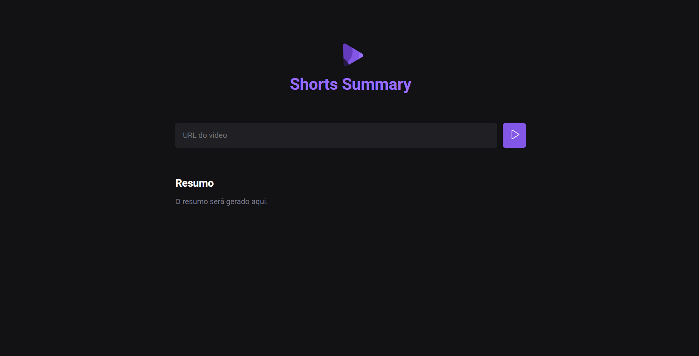

# Shorts Summary

Shorts Summary is a web application to create summaries of YouTube's short videos, using Artificial Intelligence (AI). <br>
By passing a short's link, the first AI transcribes the audio content of the video and the second one summarizes it. <br>
This project was developed in the Rocketseat's Next Level Week IA, Foundations track.

## Technologies

- HTML <br>
- CSS <br>
- JavaScript <br>
- NodeJS <br>
- AI: <br>
- Whisper (to transcribe) <br>
- Bart (to summarize) <br>

## Get started

To use Shorts Summary, you must have VSCode and NodeJS installed.

- Clone this repository <br>
- Open it in VSCode <br>
- Open the Terminal and write: <br>

```
npm install
```

<br>

```
npm run web
```

<br>

```
npm run server
```

<br>

